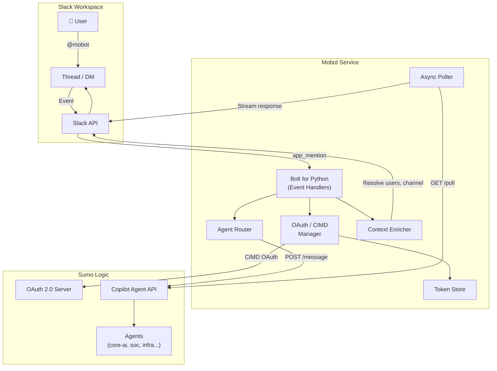
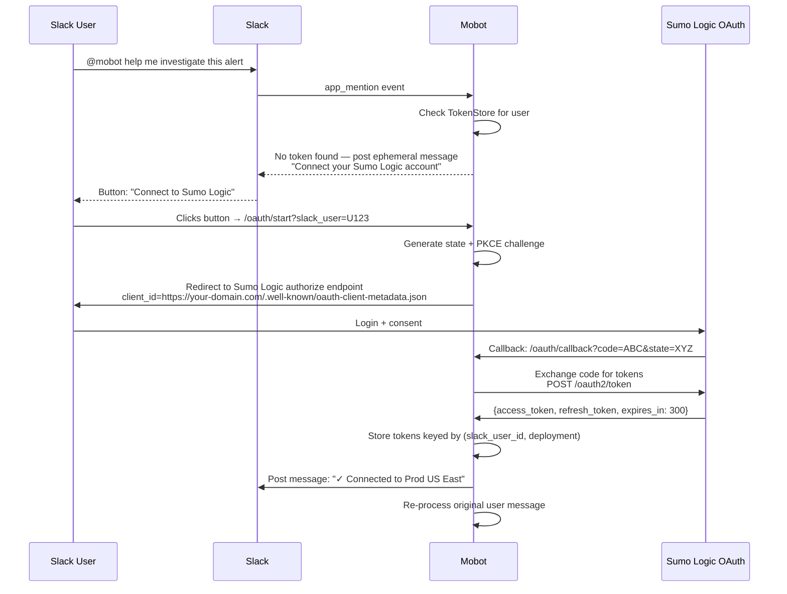
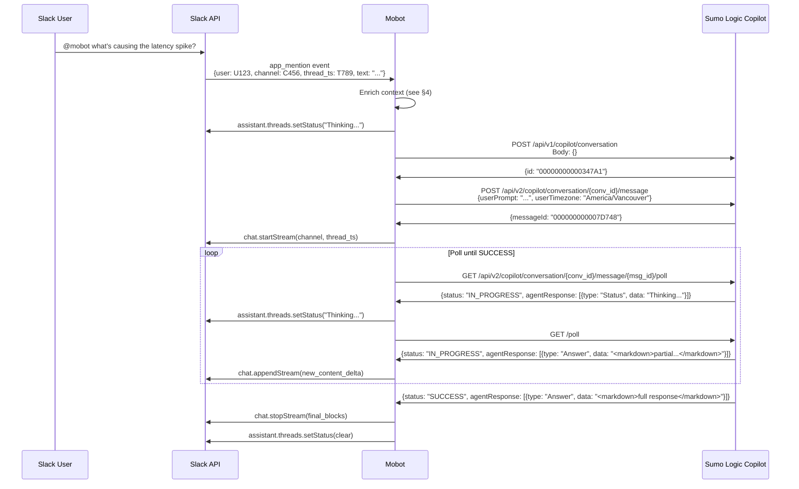
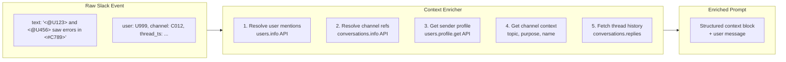
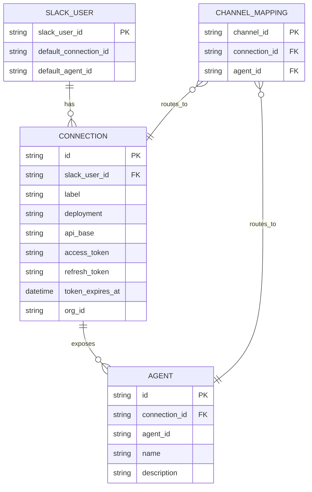
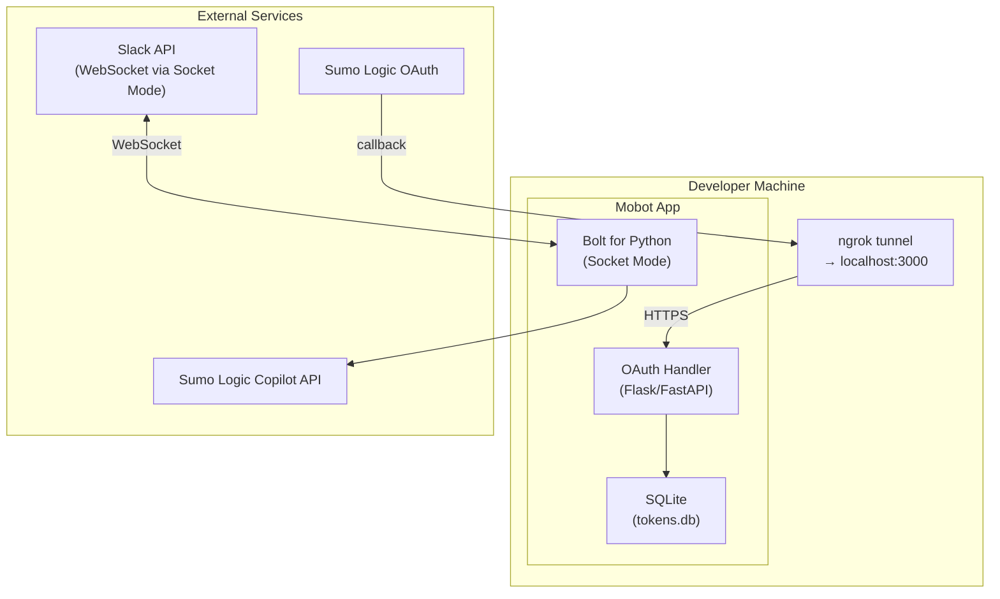
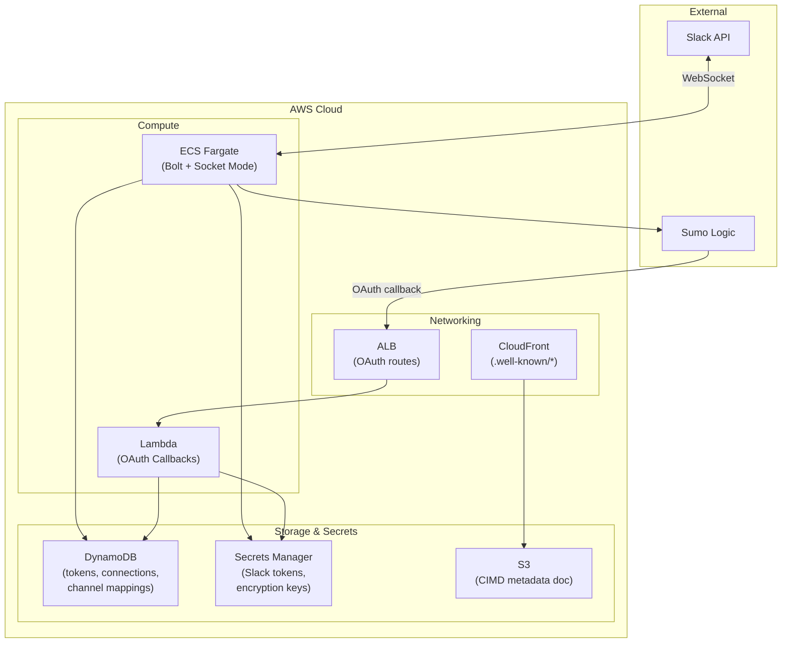
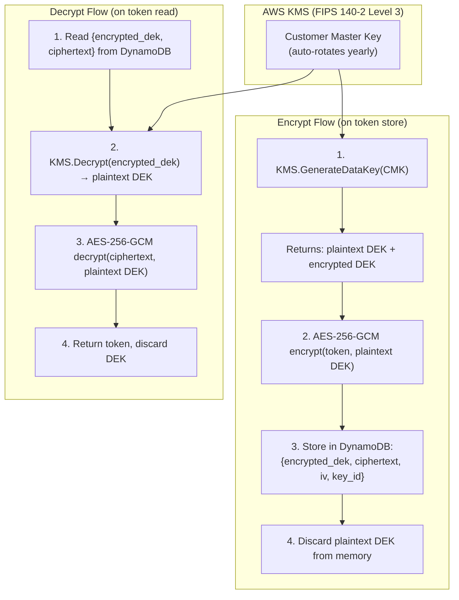
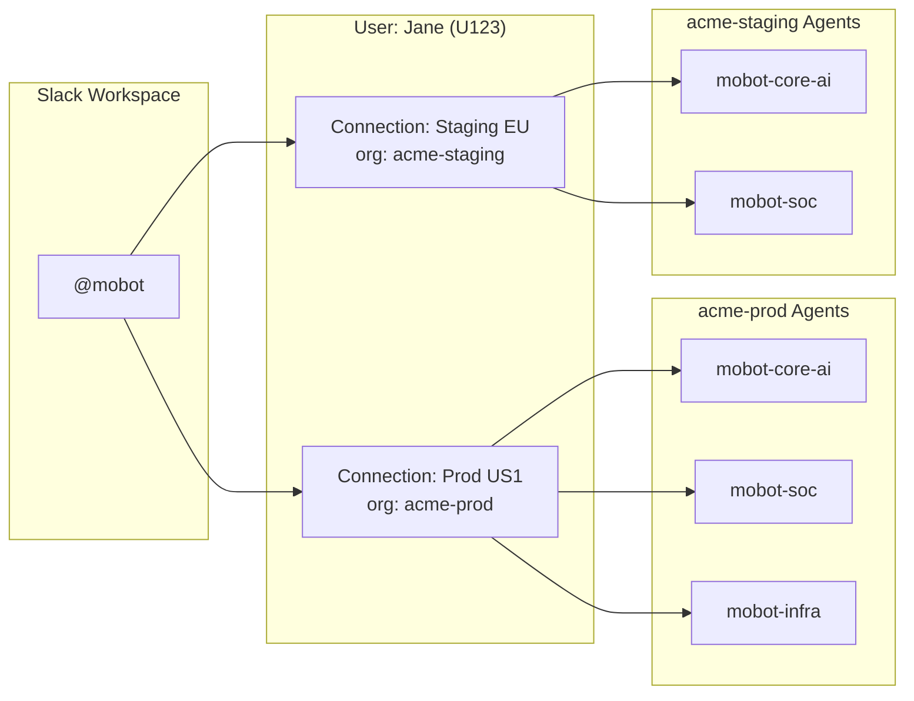

# Mobot — Slack Agent Architecture

## 1. System Overview

Mobot is a Slack Agent app that bridges Slack conversations to Sumo Logic's Copilot agent API. Users interact with `@mobot` in Slack threads; the bot authenticates via CIMD-based OAuth 2.0, enriches the request with user/channel context, routes to the appropriate Sumo Logic agent, and streams responses back.



---

## 2. OAuth / CIMD Authentication Flow

CIMD (Client ID Metadata Documents) allows Mobot to authenticate users without pre-registering an OAuth client in each Sumo Logic org. The app hosts a metadata document at a well-known URL, which serves as its `client_id`.

### 2.1 Hosted Metadata Document

```json
// https://your-domain.com/.well-known/oauth-client-metadata.json
{
  "client_name": "Mobot - Slack Agent",
  "client_uri": "https://your-domain.com",
  "logo_uri": "https://your-domain.com/logo.png",
  "redirect_uris": ["https://your-domain.com/oauth/callback"],
  "grant_types": ["authorization_code"],
  "response_types": ["code"],
  "token_endpoint_auth_method": "none",
  "scope": "runLogSearch runMetricsQuery viewLibrary manageCollectors"
}
```

### 2.2 First-Time Authentication Sequence



### 2.3 Token Refresh (automatic)

Access tokens expire in 5 minutes. On every API call:

```mermaid
flowchart TD
    A[API Call needed] --> B{Token expired?}
    B -->|No| C[Use existing token]
    B -->|Yes| D[POST /oauth2/token<br/>grant_type=refresh_token]
    D --> E{Refresh succeeded?}
    E -->|Yes| F[Update TokenStore<br/>Proceed with call]
    E -->|No| G[Notify user:<br/>"Session expired, please reconnect"]
```

### 2.4 Deployment-Specific Endpoints

| Deployment | Authorize Endpoint | Token Endpoint |
|---|---|---|
| US1 (N. Virginia) | `https://service.sumologic.com/oauth2/authorize` | `https://service.sumologic.com/oauth2/token` |
| US2 (Oregon) | `https://service.us2.sumologic.com/oauth2/authorize` | `https://service.us2.sumologic.com/oauth2/token` |
| EU (Ireland) | `https://service.eu.sumologic.com/oauth2/authorize` | `https://service.eu.sumologic.com/oauth2/token` |
| DE (Frankfurt) | `https://service.de.sumologic.com/oauth2/authorize` | `https://service.de.sumologic.com/oauth2/token` |
| AU (Sydney) | `https://service.au.sumologic.com/oauth2/authorize` | `https://service.au.sumologic.com/oauth2/token` |
| JP (Tokyo) | `https://service.jp.sumologic.com/oauth2/authorize` | `https://service.jp.sumologic.com/oauth2/token` |
| CA (Canada) | `https://service.ca.sumologic.com/oauth2/authorize` | `https://service.ca.sumologic.com/oauth2/token` |
| KR (Seoul) | `https://service.kr.sumologic.com/oauth2/authorize` | `https://service.kr.sumologic.com/oauth2/token` |

**Prerequisite per Sumo org:** Admin must enable "Enable CIMD Clients" under Administration → Account Security Settings → Policies.

---

## 3. Message Flow — @mention to Response



### 3.1 Poll-to-Stream Delta Logic

The Sumo API returns **accumulated** content (not deltas). Mobot tracks the last-seen content length and computes the delta:

```python
last_content = ""
while status == "IN_PROGRESS":
    response = poll(conv_id, msg_id)
    for item in response["agentResponse"]:
        if item["type"] == "Answer":
            current = strip_markdown_tags(item["data"])
            delta = current[len(last_content):]
            if delta:
                slack.append_stream(stream_id, delta)
            last_content = current
    await asyncio.sleep(1)  # poll interval
```

---

## 4. User Context Enrichment

Before sending the user's message to Sumo Logic, Mobot enriches it with Slack context.



### 4.1 Enriched Prompt Structure

The prompt sent to the Sumo Copilot API includes a context preamble:

```json
{
  "userPrompt": "[CONTEXT]\nRequester: Jane Smith (jane@acme.com), Senior SRE, Team: Platform\nTimezone: America/Vancouver\nChannel: #prod-alerts (purpose: Production incident alerts and triage)\nThread participants: Jane Smith, Bob Lee, @mobot\nMentioned users: Alice Chen (alice@acme.com), DevOps Lead\n\n[MESSAGE]\nAlice and Bob saw errors in the prod-alerts channel — what's the root cause?\n",
  "userTimezone": "America/Vancouver"
}
```

### 4.2 Resolution Strategy

| Slack Entity | API Call | Extracted Fields |
|---|---|---|
| `<@U123>` (user mention) | `users.info` | real_name, email, title, team |
| `<#C456>` (channel ref) | `conversations.info` | name, topic, purpose |
| Sender | `users.profile.get` | real_name, email, title, tz, team |
| Thread history | `conversations.replies` | Previous messages (for multi-turn) |

### 4.3 Caching

User and channel info is cached in-memory (TTL: 5 minutes) to avoid hitting Slack rate limits on repeated lookups.

---

## 5. Multi-Account / Multi-Agent Routing

### 5.1 Data Model



### 5.2 Routing Logic

```mermaid
flowchart TD
    A["@mobot mention received"] --> B{Explicit agent command?<br/>"@mobot use soc"}
    B -->|Yes| C[Set session agent]
    B -->|No| D{Channel mapping exists?}
    D -->|Yes| E[Use mapped agent]
    D -->|No| F{User has default?}
    F -->|Yes| G[Use user's default agent]
    F -->|No| H{User has single connection?}
    H -->|Yes| I[Use first agent on that connection]
    H -->|No| J[Show picker:<br/>Select account & agent]
```

### 5.3 User Commands

| Command | Action |
|---|---|
| `@mobot connect` | Start OAuth flow for new Sumo account |
| `@mobot connections` | List connected accounts + agents |
| `@mobot use <agent>` | Switch active agent for this thread |
| `@mobot set-default <agent>` | Set default agent across all threads |
| `@mobot disconnect <connection>` | Remove a connected account |

---

## 6. Local Development Architecture



### 6.1 Local Setup

```bash
# Prerequisites
python 3.11+
ngrok (for OAuth callbacks)

# Project structure
slack-integrates-to-mobot/
├── app.py                    # Bolt app entry point (Socket Mode)
├── oauth_server.py           # Flask app for OAuth callback
├── config.py                 # Environment-based config
├── sumo/
│   ├── client.py             # Sumo Logic Copilot API client
│   ├── oauth.py              # CIMD OAuth flow manager
│   └── models.py             # API request/response models
├── slack_handlers/
│   ├── mention.py            # @mobot mention handler
│   ├── commands.py           # User commands (connect, use, etc.)
│   └── context.py            # Context enrichment
├── routing/
│   ├── router.py             # Agent routing logic
│   └── channel_map.py        # Channel → agent mappings
├── storage/
│   ├── base.py               # Abstract token store interface
│   ├── sqlite_store.py       # Local dev: SQLite
│   └── dynamo_store.py       # Production: DynamoDB
├── docs/
│   └── architecture.md       # This document
├── .env.example              # Environment variables template
├── requirements.txt
└── README.md
```

### 6.2 Environment Variables (Local)

```bash
# Slack
SLACK_BOT_TOKEN=xoxb-...
SLACK_APP_TOKEN=xapp-...          # Socket Mode token
SLACK_SIGNING_SECRET=...

# OAuth (for CIMD callback)
OAUTH_CALLBACK_URL=https://<ngrok-id>.ngrok.io/oauth/callback
CIMD_METADATA_URL=https://<ngrok-id>.ngrok.io/.well-known/oauth-client-metadata.json

# Storage
TOKEN_STORE_BACKEND=sqlite
SQLITE_DB_PATH=./tokens.db

# App
LOG_LEVEL=DEBUG
POLL_INTERVAL_SECONDS=1
POLL_TIMEOUT_SECONDS=120
```

### 6.3 Running Locally

```bash
# Terminal 1: ngrok tunnel for OAuth callbacks
ngrok http 3000

# Terminal 2: OAuth callback server
python oauth_server.py  # Listens on :3000

# Terminal 3: Slack bot (Socket Mode — no public URL needed)
python app.py
```

---

## 7. AWS Production Architecture



### 7.1 Component Responsibilities

| Component | Role |
|---|---|
| **ECS Fargate** | Long-running Bolt app via Socket Mode. Handles events, sends API calls, polls Sumo. |
| **Lambda** | Stateless OAuth callback handler. Exchanges codes, stores tokens. |
| **DynamoDB** | Stores user connections, tokens (encrypted), channel mappings, agent configs. |
| **Secrets Manager** | Slack bot/app tokens, token encryption key. |
| **S3 + CloudFront** | Hosts the CIMD metadata document at a stable public URL. |
| **ALB** | Routes `/oauth/*` to Lambda. Health checks on ECS. |

### 7.2 DynamoDB Table Design

**Table: `mobot-connections`**

| PK | SK | Attributes |
|---|---|---|
| `USER#U123` | `CONN#conn_abc` | deployment, api_base, label, org_id, access_token (encrypted), refresh_token (encrypted), expires_at |
| `USER#U123` | `AGENT#conn_abc#soc` | agent_id, name, description, endpoint |
| `USER#U123` | `META` | default_connection_id, default_agent_id |
| `CHANNEL#C456` | `MAPPING` | connection_id, agent_id |

### 7.3 Production Encryption — Envelope Encryption with KMS

Production adheres to FedRAMP/HIPAA requirements using AWS KMS envelope encryption.



**Why envelope encryption (not direct KMS Encrypt/Decrypt)?**
- KMS has a 4KB limit per call — fits tokens, but each read/write = KMS API call = latency + cost
- Envelope encryption: KMS only wraps/unwraps the DEK (fast), actual crypto is local AES (very fast)
- At scale with many concurrent users, this avoids KMS rate limits (5,500 req/s per key)

**Compliance matrix:**

| Requirement | Implementation |
|---|---|
| Encryption at rest | AES-256-GCM via KMS-generated DEKs |
| Key management | AWS KMS CMK (FIPS 140-2 Level 3 HSMs) |
| Key rotation | Automatic annual CMK rotation + DEK re-wrap on token refresh |
| Access control | IAM: only ECS task role + Lambda role can call KMS Decrypt |
| Audit trail | CloudTrail logs every KMS GenerateDataKey / Decrypt call |
| Separation of duties | App can encrypt/decrypt; cannot manage/delete/disable keys |
| Data residency | KMS keys are region-bound; DynamoDB in same region |
| Network isolation | VPC endpoints for KMS + DynamoDB (no public internet transit) |
| Token TTL | Refresh tokens expire after 30 days; require re-auth |
| Per-user isolation | Each user gets unique DEK; compromising one doesn't expose others |

**DynamoDB record structure (encrypted):**

| Field | Value |
|---|---|
| `encrypted_dek` | KMS-wrapped data encryption key (base64) |
| `ciphertext` | AES-256-GCM encrypted token blob (base64) |
| `iv` | Initialization vector (base64) |
| `kms_key_id` | ARN of the CMK used |
| `encrypted_at` | Timestamp of encryption |

**IAM policy (ECS task role):**

```json
{
  "Effect": "Allow",
  "Action": ["kms:GenerateDataKey", "kms:Decrypt"],
  "Resource": "arn:aws:kms:us-east-1:ACCOUNT:key/KEY-ID",
  "Condition": {
    "StringEquals": {
      "kms:ViaService": "dynamodb.us-east-1.amazonaws.com"
    }
  }
}
```

### 7.4 Production Environment Variables

```bash
# Slack (from Secrets Manager)
SLACK_BOT_TOKEN=secretsmanager:mobot/slack-bot-token
SLACK_APP_TOKEN=secretsmanager:mobot/slack-app-token

# OAuth
OAUTH_CALLBACK_URL=https://mobot.your-domain.com/oauth/callback
CIMD_METADATA_URL=https://cdn.your-domain.com/.well-known/oauth-client-metadata.json

# Storage
TOKEN_STORE_BACKEND=dynamodb
DYNAMODB_TABLE=mobot-connections
KMS_KEY_ARN=arn:aws:kms:us-east-1:ACCOUNT:key/KEY-ID

# App
LOG_LEVEL=INFO
POLL_INTERVAL_SECONDS=1
POLL_TIMEOUT_SECONDS=120
```

### 7.5 Scaling Considerations

| Concern | Solution |
|---|---|
| Multiple concurrent polls | Async polling with `asyncio` — single ECS task handles many threads |
| Token refresh storms | Token refresh with jitter + lock (DynamoDB conditional write) |
| Slack rate limits | User/channel info cache (5 min TTL) + exponential backoff |
| Multi-region Sumo orgs | Connection stores deployment info — API calls go to correct region |
| High availability | ECS desired count ≥ 2, Socket Mode auto-reconnects |

---

## 8. API Contract Reference

### 8.1 Create Conversation

```
POST /api/v1/copilot/conversation
Host: {deployment}.sumologic.net
Authorization: Bearer {access_token}
Content-Type: application/json

Request Body: {}

Response: { "id": "00000000000347A1", ... }
```

### 8.2 Send Message

```
POST /api/v2/copilot/conversation/{conversation_id}/message
Host: {deployment}.sumologic.net
Authorization: Bearer {access_token}
Content-Type: application/json

Request Body:
{
  "userPrompt": "What's causing the latency spike?",
  "userTimezone": "America/Vancouver"
}

Response: { "messageId": "000000000007D748", ... }
```

### 8.3 Poll for Response

```
GET /api/v2/copilot/conversation/{conversation_id}/message/{message_id}/poll
Host: {deployment}.sumologic.net
Authorization: Bearer {access_token}

Response (progressive):

# Empty (just started)
{"agentResponse": [], "status": "IN_PROGRESS", "failureReason": null}

# Status update
{"agentResponse": [{"type": "Status", "data": "Thinking..."}], "status": "IN_PROGRESS", "failureReason": null}

# Partial answer (accumulated, not delta)
{"agentResponse": [{"type": "Answer", "data": "<markdown>partial content...</markdown>"}], "status": "IN_PROGRESS", "failureReason": null}

# Complete
{"agentResponse": [{"type": "Answer", "data": "<markdown>full response here</markdown>"}], "status": "SUCCESS", "failureReason": null}

# Failed
{"agentResponse": [...], "status": "FAILED", "failureReason": "error description"}
```

### 8.4 Auth Header Mapping

Currently the API uses `apisession` header (session-based). With OAuth/CIMD, this becomes:

```
Authorization: Bearer {access_token}
```

The Sumo Logic API accepts both forms — OAuth tokens work with all Sumo APIs via standard Bearer auth.

---

## 9. Scalability — Multiple Orgs × Multiple Agents



### 9.1 Agent Discovery

After OAuth, Mobot queries the connected org to discover available agents:

```
GET /api/v1/copilot/agents
Host: {deployment}.sumologic.net
Authorization: Bearer {access_token}

Response:
{
  "agents": [
    {"id": "core-ai", "name": "Core AI", "description": "General observability assistant"},
    {"id": "soc", "name": "SOC", "description": "Security operations assistant"},
    {"id": "infra", "name": "Infrastructure", "description": "Infrastructure monitoring"}
  ]
}
```

*(Endpoint assumed — verify with Sumo Logic API docs)*

### 9.2 Conversation Isolation

Each (user, connection, agent, slack_thread) tuple gets its own Sumo conversation ID:

```
Conversation key: (slack_user_id, connection_id, agent_id, slack_thread_ts)
```

This ensures:
- Different threads don't leak context
- Switching agents starts a fresh conversation
- Multi-turn within a thread maintains history via the Sumo conversation

---

## 10. Error Handling & Edge Cases

| Scenario | Behavior |
|---|---|
| OAuth token expired + refresh fails | Ephemeral msg: "Session expired. Click to reconnect." |
| Sumo API timeout (poll > 120s) | Post: "Request timed out. Try a simpler question or check Sumo Logic directly." |
| Poll returns `FAILED` | Post error with `failureReason`, offer retry button |
| User has no connections | Onboarding flow with "Connect" button |
| User mentions @mobot in public channel without access | Ephemeral: "I can only help in channels I've been invited to." |
| CIMD not enabled on target org | Clear error: "Your Sumo Logic admin needs to enable CIMD clients." |
| Rate limited by Slack | Exponential backoff, queue pending responses |
| Multiple @mobot mentions in rapid succession | Queue and process sequentially per thread |
